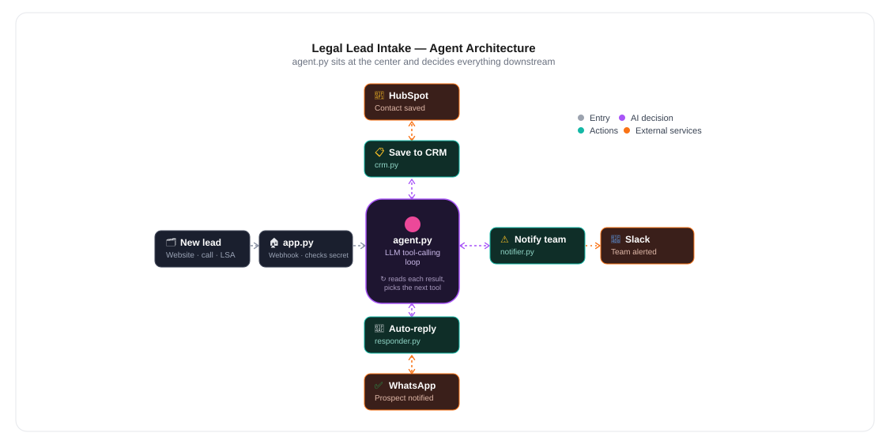

# Legal Lead Intake Agent

An AI agent that receives new law-firm leads (website form, phone call
transcript, or Google LSA notification), classifies the case using an
LLM with tool-calling, saves it to HubSpot CRM, alerts the intake team
on Slack, and sends the prospect an instant WhatsApp auto-reply — end
to end, with no human in the loop.

This is a **true agent**, not a fixed script: the LLM is given three
tools and decides for itself which ones to call, in what order, and
with what data. Nothing about "classify → CRM → Slack → WhatsApp" is
hardcoded — the loop in `agent.py` lets the model call one tool, read
the result, and choose its next step on its own.

## Architecture



**Flow in words:**
1. A lead comes in as a webhook `POST` to `/webhook/lead?secret=...`
   (from a website form, CallRail, or Google LSA).
2. `app.py` checks the shared secret, then normalises the payload and
   pulls out Google Ads attribution (`gclid`, `utm_*`) if present.
3. `agent.py` hands the lead's raw text to an LLM along with three
   available tools.
4. The LLM decides on its own which tools to call, in what order, and
   with what arguments — reading each tool's result before choosing
   its next step.
5. Each tool call hits a real external API: `save_lead_to_crm`
   (HubSpot), `notify_team` (Slack), `send_auto_reply` (WhatsApp via
   Meta Cloud API).
6. The final result is returned as JSON and recorded for the live
   dashboard (`/`).

## Project structure

\```
app.py                Flask webhook + dashboard routes
agent.py               The agent loop: LLM + tool calling
config.py               Loads all settings from .env
tools/
  definitions.py         Tool schemas the LLM sees
  crm.py                 HubSpot integration
  notifier.py             Slack integration
  responder.py            WhatsApp (Meta Cloud API) integration
templates/
  dashboard.html           Live activity dashboard UI
docs/
  architecture.svg          Diagram used in this README
test_lead.py             Sends sample leads for local testing
\```

## Setup

1. Install dependencies: `pip install -r requirements.txt`
2. Copy `.env.example` to `.env` and fill in your API keys.
3. In HubSpot, create Contact properties: `practice_area`,
   `incident_date`, `key_details`, `lead_urgency`, plus `source`,
   `gclid`, `utm_source`, `utm_medium`, `utm_campaign`, `utm_term`,
   `utm_content`.
4. In Meta's WhatsApp Manager, create and get approval for a message
   template matching `WHATSAPP_TEMPLATE_NAME`.
5. Run: `python app.py`
6. Test: `python test_lead.py`
7. Dashboard: `http://127.0.0.1:5000/`

## Deploying

Ships with a `Procfile` for Railway. Push to GitHub, create a Railway
project from the repo, add your `.env` variables in Railway's
"Variables" tab, then point the client's webhook config at:
`https://your-app.up.railway.app/webhook/lead?secret=YOUR_SECRET`

## A note on compliance

Automated messaging to prospects is subject to consent rules (TCPA in
the US, WhatsApp's business-messaging policy). Confirm wording and
opt-in with the firm's compliance team before going live.